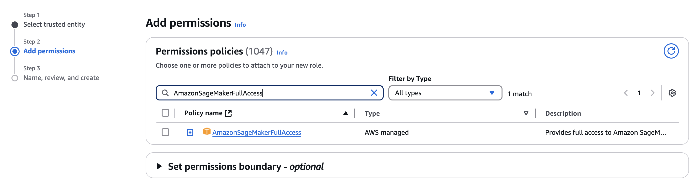

# AWS SageMaker AI

> [!Note]
> 

This is a tutorial focused on utilizing AWS SageMaker AI - creating, training, deploying your own ML models, hosting then as endpoint in serverless architecture and creating a simple workflow which will automate your ML Pipeline without the need of local GPUs.

> [!Note]
> This tutorial assumes that you are already familiar with the use of AWS S3 buckets, S2 instances and Docker containers.

## AWS SageMaker AI - Concepts

### Jupyter Notebooks

### Models

### Endpoints

### Pricing


## Python Modules

### pandas


### scikit-learn


## Task 1.1 - IAM Configuration

Create new Role from the IAM -> Access Management -> Roles. For custom trust policy put in the following code:
```json
{
  "Version": "2012-10-17",
  "Statement": [
    {
      "Effect": "Allow",
      "Principal": {
        "Service": "sagemaker.amazonaws.com"
      },
      "Action": "sts:AssumeRole"
    }
  ]
}
```
Follow to the next section and search for `AmazonSageMakerFullAccess` and click it:


Name it `AmazonSageMaker-TrainingExecutionRole`.

## Task 1.2 - S3 Configuration

Create a bucket called: `ccbda-research-sagemaker` with all of the default settings.


